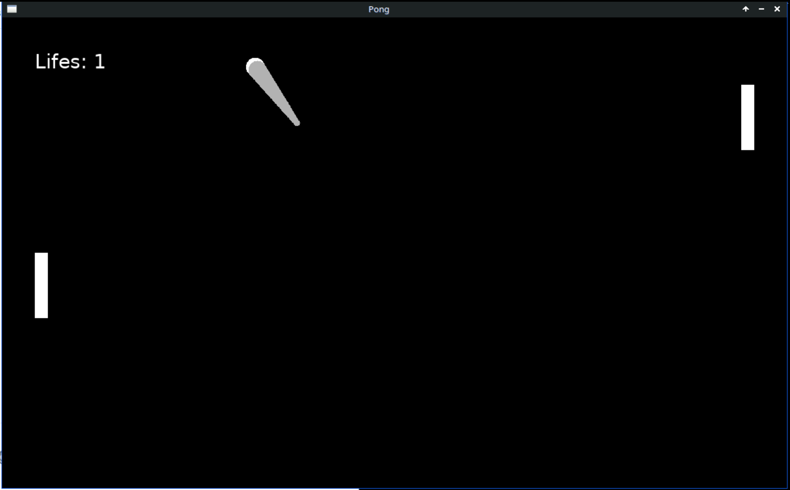
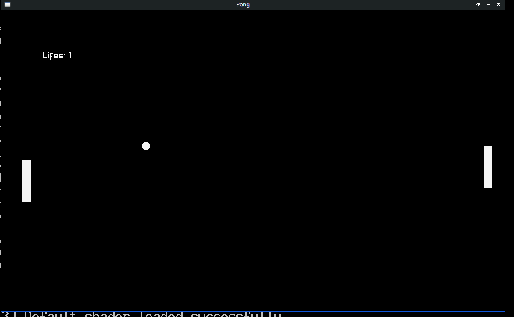

# Pong
A Pong Game written in Lua Love2D and C++ Raylib

This game was made mainly to compare two different game libraries across languages




# Build
## Requirements for Love2D
`lua, love2d`
```
cd love2d && love .
```
## Requirements for Raylib
`glfw, raylib`
```
cd raylib && make . && ./pong
```